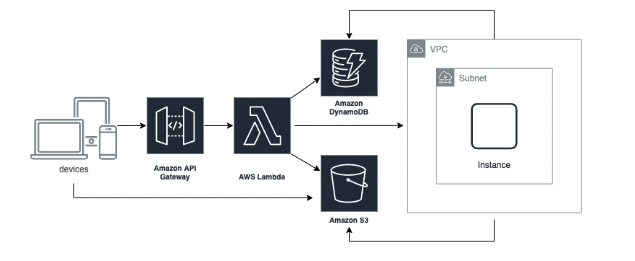

# Fovus challenge

This project uploads a file to a S3 bucket and updates a DynamoDB table with the file's metadata through a Lambda function.
Then it triggers a Lambda that does the following operations:

- Creates a new EC2 instance
- Downloads the script from the S3 bucket (could be uploaded by the user or by the previous Lambda function).
- Executes the script:
  + Gets the inputs from DynamoDB by their ID.
  + Append the retrieved input text to the downloaded input file and save it.
  + Upload the updated file to the S3 bucket overwriting the old one.
  
- Save the newly created file's metadata to the DynamoDB table.

- After the execution of the script, the Lambda function terminates the VM.

## Architecture


## Development
### Prerequisites
- [Node.js](https://nodejs.org/en/download/)
- [npm](https://www.npmjs.com/get-npm)
- [AWS Lambda](https://aws.amazon.com/lambda/)
- [AWS S3](https://aws.amazon.com/s3/)
- [AWS DynamoDB](https://aws.amazon.com/dynamodb/)
- [AWS EC2](https://aws.amazon.com/ec2/)
- [AWS IAM](https://aws.amazon.com/iam/)
- [AWS CloudWatch](https://aws.amazon.com/cloudwatch/)
### Getting started
1. Clone the repository
2. Install dependencies
    ```bash
    npm install
    ```
3. Create a `.env` file in the root directory and add the following environment variables:
    ```bash
    REACT_APP_AWS_ACCESS_KEY_ID=YOUR_AWS_ACCESS_KEY_ID
    REACT_APP_AWS_SECRET_ACCESS_KEY=YOUR_AWS_SECRET_ACCESS_KEY
    REACT_APP_AWS_REGION=YOUR_AWS_REGION
    REACT_APP_S3_BUCKET=YOUR_S3_BUCKET_NAME
    REACT_APP_API_URL=YOUR_API_GATEWAY_URL
    ```
4. Run the app
    ```bash
    npm start
    ```
   Runs the app in the development mode.\
Open [http://localhost:3000](http://localhost:3000) to view it in your browser.

##  Deploying the project to Amplify

### Pre-requisites
1. [Amplify](https://docs.amplify.aws/cli/start/install) installed
### Getting started
1. Clone the repository
2. Follow the steps in the [Amplify documentation](https://docs.amplify.aws/guides/hosting/git-based-deployments/q/platform/js/#4-deploy-your-app-to-aws-amplify) to initialize the project


This project was bootstrapped with [Create React App](https://github.com/facebook/create-react-app).

